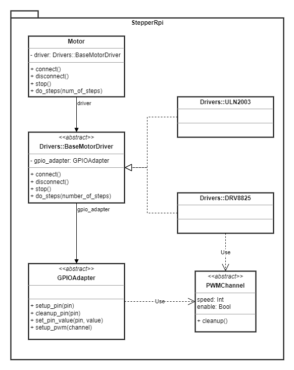

# StepperRpi

Provides a simple and a convenient way to control a stepper motor from the
Raspberry Pi board. There are a lot of different stepper motors and a various
drivers to control them, and this library takes this into account and provides
a couple of abstractions - implementing them we can control literally any
stepper motor without touching the main interface.

## Installation

Add this line to your application's Gemfile:

```ruby
gem 'stepper_rpi', github: 'sergio1990/stepper_rpi'
```

And then execute:

    $ bundle install

## Usage

There are various drivers available for stepper motors control, such as:

- ULN2003
- A4988
- DRV8825
- etc...

Also, there are [various](https://rubygems.org/search?query=rpi) gems available
in order to perform GPIO management on Raspberry Pi.

In order to make this library useful for the most possible cases, two abstractions were added:

- abstract driver
- abstract GPIO adapter

The class diagram represents all the mentioned abstractions and their
relationships with another classes:



Hence, in order to use this library the next things should be implemented:

- a driver - according to the microchip you're going to use; the driver for the
  [ULN2003](https://github.com/sergio1990/stepper_rpi/blob/main/lib/stepper_rpi/drivers/uln2003.rb) chip is available OOTB
- a GPIO adapter - no adapter available OOTB so far, just use your favorite
  GPIO wrapper gem when implementing your own GPIO adapter

Please, visit the
[examples](https://github.com/sergio1990/stepper_rpi/tree/main/examples) folder
to get insights about how to use the library.

## Tests

This library was successfully tested using the following hardware combinations:

- Raspberry Pi Zero W v1.1; ULN2003 driver shield; 28BYJ-48-5V stepper motor

## Contributing

Bug reports and pull requests are welcome on GitHub at https://github.com/sergio1990/stepper_rpi.

## License

The gem is available as open source under the terms of the [MIT License](https://opensource.org/licenses/MIT).
